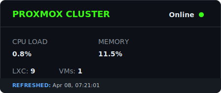

- **🔭 Working on:** [absent.one](https://absent.one)
- **💻 Stack:** C#, C++, TypeScript, Angular
- **🏠 Homelab:** Custom Proxmox cluster (running way too many containers)

---

### Stack

  

---

### Metrics

  
  

### 📡 System Telemetry

  

